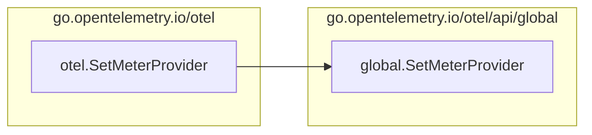

https://github.com/open-telemetry/opentelemetry-go-contrib

https://github.com/open-telemetry/opentelemetry-go-contrib/tree/main/instrumentation/net/http/otelhttp/example

```sh
go get go.opentelemetry.io/contrib/instrumentation/net/http

```




Package trace contains support for OpenTelemetry distributed tracing.
https://pkg.go.dev/go.opentelemetry.io/otel/sdk/trace
